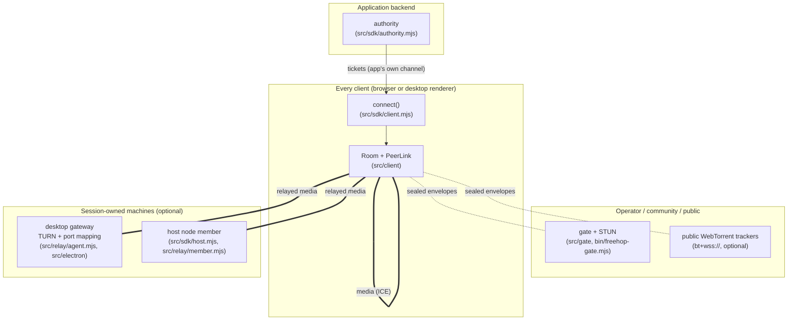
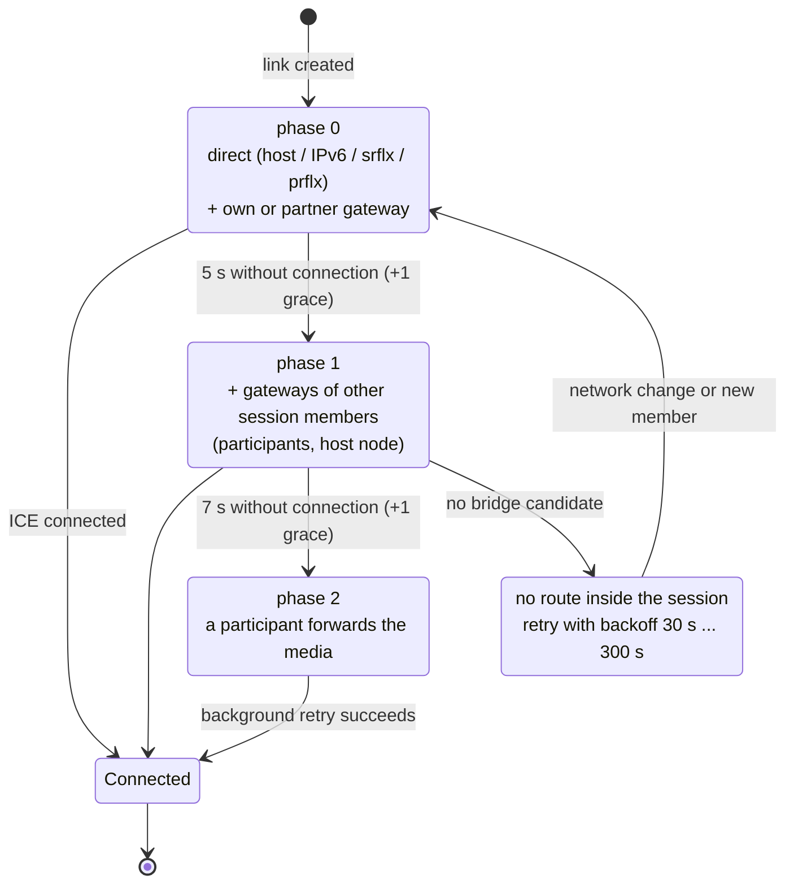
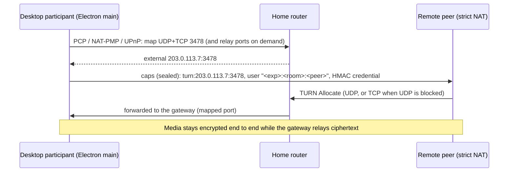

# Freehop architecture

This document explains how Freehop is put together and why. For the normative wire format, see
[PROTOCOL.md](PROTOCOL.md); for integrating it, see [SDK.md](SDK.md).

## 1. Design goals

| Goal | Consequence |
|---|---|
| Signalling gates never carry media | Two separate planes: a **signalling plane** (gates) and a **media plane** (peer paths). Gates are bounded so that media cannot fit through them. |
| Media cost stays with the session | Fallback routes use only machines that belong to the session: endpoint gateways, the host node, participants. The one exception is opt-in: an application can add its own TURN relay as a last resort (`turn`). |
| No single point of failure | Any number of interchangeable gates; signalling moves onto the mesh once peers are linked. |
| Gates are untrusted | End-to-end sealed envelopes; membership only after authentication. |
| Zero configuration for users | Tickets from the app backend; automatic path escalation; automatic router port mapping on desktop. |
| Embeddable | Small modules with no runtime dependency in the browser; one SDK for every consumer. |

**Current scope:** a flexible mesh SDK with an initial target of 2–8 participants, not a benchmarked capacity limit. Larger rooms await capacity testing. Non-goals include guaranteed connectivity on
networks that can reach only the operator's server; recording or transcoding.

## 2. Components

### Module map

| Module | Role |
|---|---|
| `src/client/crypto.mjs` | HKDF room-tag and key derivation, AES-256-GCM seal/open with AAD binding (room, sender, recipient) |
| `src/client/gate-client.mjs` | One WebSocket gate: hello/join, keepalive, reconnect with backoff |
| `src/client/tracker-client.mjs` | WebTorrent tracker used as a gate (offers = hellos, answers = envelopes) |
| `src/client/room.mjs` | The orchestrator: hints and admission, routing (mesh → gates → introducer → outbox), caps, path ladder, bridging, per-link adaptive video, media controls, departures, rekey |
| `src/client/peer.mjs` | One `RTCPeerConnection` per remote peer: perfect negotiation, candidate buffering, offer timeout, single-initiator ICE restarts, path classification |
| `src/client/nat.mjs` | Opt-in NAT classification from the browser's own srflx candidates, validation of a peer's NAT claim, bounded port prediction |
| `src/client/ice-urls.mjs` | STUN and TURN URL validation, including the application's TURN servers |
| `src/sdk/authority.mjs` | Backend: room secrets, tickets, kick-and-rotate |
| `src/sdk/client.mjs` | `connect(ticket)`: desktop-gateway detection, `update()`, `disconnectPeer()`, `levels()`, `attach()` |
| `src/sdk/host.mjs` | `hostSession(ticket)`: shared process gateway plus gateway member |
| `src/sdk/ticket.mjs` | Ticket validation and compact encoding |
| `src/gate/gate.mjs` | The gate: admission tokens, rooms, routing, byte and message budgets, backpressure |
| `src/gate/stun-responder.mjs` | RFC 8489 Binding responder (IPv4 and IPv6) |
| `src/relay/turn-server.mjs` | TURN server (RFC 8656 subset): UDP/TCP/TLS clients, permissions, channels, internal relay↔relay, rate limits |
| `src/relay/port-mapper.mjs` | PCP → NAT-PMP → UPnP IGD client with renewal and SSRF guards |
| `src/relay/agent.mjs` | Gateway: TURN + mappings + room-scoped, revocable TURN REST credentials |
| `src/relay/member.mjs` | Gateway member: joins a room without media and offers its gateway per peer |
| `src/electron/` | Main-process helper (`installFreehopGateway`) and origin-restricted preload (`window.freehopGateway`) |
| `src/shared/stun.mjs`, `src/shared/tokens.mjs` | STUN/TURN codec; gate admission tokens |

## 3. The two planes

### Signalling plane
- **Room identity.** A room is identified to gates only by `roomTag = HKDF(secret, "room-tag")`.
- **Envelopes.** Every message between peers is an envelope
  `AES-256-GCM(HKDF(secret, "envelope-key"), payload, AAD = room|from|to)` with a per-sender
  counter for replay protection.
- **Routing.** In order of preference:
  1. the peers' own data channel, used only while the link is connected;
  2. every gate where the recipient is present;
  3. a connected neighbour that knows the recipient (the "introducer");
  4. a short-lived outbox.
- **Membership.** Gate rosters are hints only. A peer becomes a member once one of its
  envelopes authenticates.

### Media plane: the path ladder

- **Single initiator.** Only the impolite peer restarts ICE. The polite peer applies the same
  servers and takes over after 2.5 s if nothing arrives. Simultaneous restarts collide (glare)
  and were observed to silence a browser's RTP senders.
- **Classification.** Each path is classified from the selected candidate pair:
  - `direct`: no relay on either side;
  - `gateway`: the relay is owned by one of the two endpoints;
  - `relay`: the relay is owned by another session member;
  - `bridged`: a participant forwards the media.
- **Refresh.** Classification is retried while browser stats settle and refreshed every 5 s.
  This also catches later route upgrades.
- **Opt-in rungs.** Before a pair is reported unreachable, an application may enable port
  prediction (`portPrediction`, for NATs that allocate ports in order) and its own TURN relay
  (`turn`, reported as `relay` via `'turn'`). Both reuse the restart rules above, add no phase,
  envelope kind or path kind, and fall through to unreachable on failure (PROTOCOL.md §7a). A pair
  the TURN relay carries keeps checking for a cheaper route and releases the relay once one holds;
  a later failure runs the ladder again, TURN last.

## 4. Gateways

- **Reachability.** The gateway uses a public address directly, or a router mapping. A mapping
  that returns a private or carrier-grade NAT (CGNAT) external address is not offered.
- **Credentials.** TURN REST style, scoped to a room and a peer, valid for 2 h by default (configurable from 1 s to 24 h). The signing key stays in the privileged process; renderers request bounded credentials through a broker. Rooms are allowed explicitly; rotation revokes the whole old epoch, including alias allocations.
- **Policy.**
  - The TURN server refuses loopback, link-local, multicast, private peers and selected IPv6 transition prefixes (6to4, Teredo, local-use NAT64).
  - The host's own addresses are reachable only relay↔relay.
  - Error replies to unauthenticated UDP sources are rate-limited.
  - TCP connections are capped per source address and have an absolute 10 s deadline to allocate.
  - Gateway quotas: 6 allocations per username, 32 per room, 64 total; 4 Mbit/s per allocation, 20 Mbit/s per room, 40 Mbit/s total, separately per direction.
  - Startup reachability does not guarantee continued reachability; mapping-loss and address-change recovery remain pending.
- **No hairpin dependency.** Traffic between two allocations on the same gateway is delivered
  internally. The owner reaches remote allocations through its own `self` allocation.

## 5. Host node, bridging and kicks

- **Host node.** The machine hosting a session (an app server, a community server or a hosting
  desktop app) calls `hostSession(ticket)`. It joins the room with a `gw_…` id, captures no media of its own, relays encrypted packets,
  and greets each authenticated member with that member's own credentials.
- **Bridging.** When a pair has no route and no untried session gateway, the lower id asks
  connected participants that can reach the other side. The forwarder:
  - accepts only an offer it made, then obtains the second endpoint's consent with `bridge-confirm` / `bridge-ready`;
  - announces `forward-map` before renegotiating;
  - adds the origin's tracks, re-encoding them;
  - stops those transceivers again on release.
  Endpoints release any duplicate forwarder.
- **Kick.** The application calls `authority.kick()`, which rotates the room secret.
  - Remaining members receive new tickets and call `session.update(ticket, {dropped})`.
    Every old-key link closes and previous-key envelopes are rejected immediately. Gates move to the new room tag and approved members reconnect; media briefly pauses.
  - Gateways revoke the entire old room epoch, including unreported aliases: the host node through `host.update()`, a desktop participant's own gateway through `session.update()`.
  - Update every remaining member and host. Machines still on the old key can communicate with old-key holders. Voluntary departures also require rotation via `authority.leave()`.

## 6. Threat model (summary)

| Actor | Can | Cannot |
|---|---|---|
| Gate operator | See IP addresses, room tags, peer ids, sizes, timing; drop or delay | Read or forge envelopes, inject members, re-route undetected, carry media |
| Network observer | See encrypted traffic metadata | Read media (DTLS-SRTP) or signalling (TLS + sealed envelopes) |
| Room member | Forge envelopes in the room's name (members trust each other); use gateway credentials until expiry or revocation | Reach private networks or loopback services through a gateway; keep access after a kick plus rotation |
| Gateway owner | Relay ciphertext; see peer IP addresses | Decrypt media |

## 7. Failure handling

| Failure | Mechanism |
|---|---|
| Lost offer or answer | Offer timeout (8 s): rollback and re-offer; an ICE restart is re-requested |
| Envelope delivered out of order | Descriptions applied only in envelope-counter order |
| Gate down or restarting | Other gates and the mesh carry signalling; outbox for 20 s; client ping keeps NAT and proxies alive |
| Peer vanished without `bye` | Sweep: absent from every gate and link not connected for 8 s, then dropped as `gone` (can return) |
| Senders silent after renegotiation | Media watchdog: no packets for 10 s triggers a single-initiator restart |
| Dead data channel still "open" | Trusted only while the link is connected; gates also carry the envelope |

## 8. Deployment topologies

1. **One gate plus STUN** behind your TLS proxy (`deploy/freehop-gate.service`,
   `deploy/Caddyfile.snippet`). This is the minimal production setup.
2. **Several gates** (yours plus community gates) listed in every ticket for resilience.
3. **Tracker-only.** `bt+wss://` public WebTorrent trackers plus public STUN, with no
   infrastructure of your own. Useful for demos and prototypes. Availability is not under
   your control.

## 9. Test architecture

- **Unit tests** (`node --test test/*.test.mjs`): the STUN codec against RFC 5769, the TURN
  server, the gate, the port mapper against fake routers, gateway credentials, NAT
  classification and the opt-in ladder rungs.
- **Release gates** (`npm run ship`): besides the unit tests, `exportsgate`, `typesgate` and
  `docsyncgate` check the public surface and the docs; `contractgate` freezes exports, wire
  constants, the ticket format and the client markers downstream apps check; `laddergate` replays
  23 path-ladder scenarios through real `Room`s on a deterministic fake `RTCPeerConnection` and
  compares them with traces checked into `tools/baselines/`.
- **Browser suites** (`test/browser/`): real Chromium, Firefox and WebKit through Playwright.
  They cover the mesh, cross-engine runs over TLS, multi-gate with a gate outage, kick/rekey,
  the public tracker, the SDK example, the application TURN rung and leaving that relay again.
- **Home-lab NAT test harness** (`lab/`): a disposable privileged Linux container with network namespaces. Each
  peer gets a router and client namespace with a NAT profile; miniupnpd plays the home router.
  Browsers run inside the namespaces with fake capture devices. `lab/docker.sh` builds the
  container from `lab/Dockerfile` and runs it with Docker, including Docker Desktop on macOS.
  `lab/docker.sh qualify` runs the 11-scenario matrix three times plus cross-engine runs and
  coturn conformance; `lab/docker.sh <scenario>` runs any single scenario, including the opt-in
  ones. `lab/summarize.mjs` turns the evidence into the table in [RESULTS.md](RESULTS.md).

---
Documentation licensed under CC BY 4.0. Copyright 2026 Jolyn Studios.
