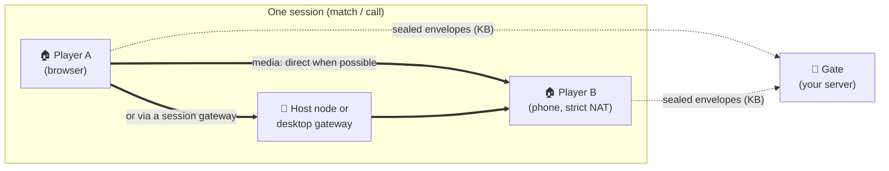

<div align="center">

# Freehop

### Voice and video between your users, without your servers carrying the call.

**[Live demo](https://jolynstudios.github.io/freehop/demo)** ·
**[Documentation](https://jolynstudios.github.io/freehop/)** ·
**[Quickstart](#quickstart)** ·
**[Architecture](ARCHITECTURE.md)** ·
**[Protocol](PROTOCOL.md)**


</div>

---

Adding voice or video to a game or app comes with a hidden bill. WebRTC connects people
directly when it can. When it can't, because of strict NATs or firewalls that block UDP, the
standard answer is a **TURN relay that you run and pay for**. Every byte of those calls flows
through your servers. Published WebRTC measurements put that at **roughly one call in five**
([callstats.io: ~22%](https://webrtchacks.com/usage-stats/),
[appear.in: ~17.7%](https://medium.com/@fippo/what-kind-of-turn-server-is-being-used-d67dbfc2ff5d)),
and managed TURN is billed per gigabyte (e.g.
[$0.05/GB](https://developers.cloudflare.com/realtime/turn/)).

**Freehop removes your servers from the media path entirely.** Your infrastructure only runs
small *gates* that introduce people to each other: tens of kilobytes of sealed signalling per
call, then nothing. When a direct connection is impossible, the call hops through machines that
**already belong to the session**: a desktop player's own router-mapped gateway, the machine
hosting the match, or another participant. The cost of a call stays with the people on it.

## Why Freehop

| | |
|---|---|
| 💸 **Zero media on your servers** | Gates carry sealed signalling only. In every lab run, gate traffic for an entire scenario stayed between 30 and 210 KB, with no media at all. |
| 🧱 **Connects the "impossible" pairs** | Two strict (symmetric) NATs, or a network that blocks UDP, can't connect directly. Freehop routes them through a session member's gateway or the session host, still with no operator relay. |
| 🛰️ **No single point of failure** | Run one gate or many, operated by you, your community, or public WebTorrent trackers. Peers on different gates still find each other. **Calls keep running when every gate is down.** |
| 🔐 **Private by construction** | Signalling is end-to-end sealed (HKDF + AES-256-GCM), so gates can't read, forge or inject anything. Media is DTLS-SRTP end to end, and relays only see ciphertext. |
| ⚙️ **Automatic** | No share links. Your backend issues a ticket, and the SDK takes the cheapest path that works: direct, then gateway, then relay, then bridge. |
| 📦 **Small and open** | Zero-dependency browser client; a gate with one dependency (`ws`); TURN gateway and PCP / NAT-PMP / UPnP port mapping in plain Node. Apache-2.0. |

## How it works



1. **Your backend issues tickets.** `createAuthority()` owns each room's secret. A member gets a ticket over your own authenticated channel.
2. **Gates introduce.** Clients announce on every gate in the ticket and exchange sealed envelopes. Once linked, signalling moves onto the peers' own data channels.
3. **The path ladder finds a route.** Freehop tries direct first (LAN, IPv6, STUN). If that fails it uses an endpoint's own gateway, then a gateway of another session member, then forwarding through a participant. A failure is reported honestly as `unreachable`.
4. **Kicks rotate keys.** `authority.kick()` issues a new room secret; remaining members `update()` and drop the kicked peer.

## Proof, not promises

Qualified in an isolated Linux lab with real **Chromium 151, Firefox 153 and WebKit 26.5**.
Each browser sits behind its own kernel NAT router profile, with fake camera and microphone.
Every run asserts the path taken and that audio *and* video actually arrive.

| Network situation | Result | Route Freehop chose |
|---|---|---|
| Two home routers | ✅ 3/3 | direct |
| IPv6 available, IPv4 UDP blocked | ✅ 3/3 (+ Firefox/WebKit) | direct over IPv6 |
| Two strict/symmetric NATs + a third participant | ✅ 3/3 (+ cross-browser) | forwarded by the participant |
| Strict NAT ↔ desktop player behind a UPnP router | ✅ 3/3 (+ cross-browser) | the desktop's own gateway |
| Two strict NATs + a desktop player | ✅ 3/3 (+ cross-browser) | relay through that player's gateway |
| UDP-blocking firewall ↔ desktop player | ✅ 3/3 (+ cross-browser) | gateway over TCP |
| Two UDP-blocked peers + a desktop player | ✅ 3/3 | relay over TCP |
| Two strict NATs, match hosted on a server node | ✅ 3/3 (+ cross-browser) | the host node's gateway |
| Two UDP-blocked peers, server-hosted match | ✅ 3/3 | the host node's gateway |
| Two strict NATs and nobody else | ✅ 3/3 | `unreachable` (correctly reported) |
| A network that can only reach the gate | ✅ 3/3 | `unreachable` (no route exists without your server) |

**40/40 lab runs passed** in the final qualification, alongside these other checks:
- **79/79 unit tests**, including the RFC 5769 STUN vectors.
- **coturn's own test client** against Freehop's TURN server: 800/800 messages over UDP and 800/800 over TCP, 0 lost.
- **Browser suites:** multi-gate with every gate shut down mid-call, kick/rekey, a public WebTorrent tracker as the only gate, and the SDK example app.

Full details are in [RESULTS.md](RESULTS.md).

## First use case: Redline Wars

[**Redline Wars**](https://redlinewars.online) is a real-time strategy game that runs in the
browser and as a desktop app ([source](https://github.com/jolynstudios/redlinewars)). It is
Freehop's first production consumer and test environment. Freehop is being integrated there
**through the public SDK only**, exactly like any other app would:

- the match host acts as the session's gateway;
- desktop players open their own front door through their router;
- browser players simply join.

Anything the game needs becomes an SDK feature.

## Quickstart

```bash
npm install github:jolynstudios/freehop    # npm registry release follows with 1.0
```

**Backend:** decide who is in a room.
```js
import { createAuthority } from 'freehop/authority';
const authority = createAuthority({ app: 'my-app', gates: ['wss://example.com/freehop'] });
await authority.openRoom('match-42');
const ticket = await authority.ticket('match-42', userId);   // send over your own channel
```

**Client:** join and play.
```js
import { connect } from 'freehop';
const session = await connect(ticket, { media: { audio: true } });
session.on('track', ({ peer, track }) => session.attach(track, audioElementFor(peer)));
session.on('path', ({ peer, kind }) => console.log(peer, 'is', kind));  // direct | gateway | relay | bridged | unreachable
```

**Gate:** the only thing you host.
```bash
FREEHOP_GATE_PORT=8787 FREEHOP_GATE_PUBLIC_HOST=example.com \
FREEHOP_GATE_STUN=0.0.0.0:3478,[::]:3478 npx freehop-gate
```

Desktop apps (Electron) and session hosts get one call each. See [SDK.md](SDK.md). For a
complete runnable consumer, run `npm run example` and open it in two windows.

## How Freehop compares

| | **Freehop** | WebRTC + your own TURN (e.g. PeerJS or simple-peer + coturn) | Managed TURN / SFU service |
|---|---|---|---|
| Who carries media when direct fails | Machines in the session (player gateways, host node, participants) | Your TURN servers | The provider's servers |
| Your media bandwidth bill | **None** | Grows with every relayed call | Per-GB or per-minute pricing |
| What your servers must run | Small gates (signalling only) | Signalling + TURN | Usually nothing (the provider runs it) |
| Network that can reach only your server | Reported `unreachable` | ✅ works (you pay) | ✅ works (you pay) |
| Room size | Small groups (mesh, 2–8) | Small groups (mesh) | Large rooms (SFU) |

Freehop is built for products where **people in the session can help carry their own call**:
games, small-group voice and video, communities. If you need 50-person rooms or a guarantee
on networks that block everything except your server, a paid relay or SFU is the right tool.

## Honest limits

- **Unrouteable networks.** A network that lets a user reach *only* your gate has no route
  for media without your server carrying it. Freehop reports `unreachable` instead of
  silently paying for a relay.
- **Hard NATs need someone with a reachable route.** Two browser-only users, both behind
  strict NATs or UDP-blocking networks, with no IPv6 and nobody else in the session, cannot
  connect.
- **Lab-qualified, not field-proven yet.** Real ISPs, 4G/5G carrier NAT, corporate networks
  and mobile browsers are being tested next. Status: **alpha**.
- **Forwarded media is re-encoded.** When a participant forwards the call, it re-encodes the
  media. That participant is in the call anyway.

## Repository map

| Path | What |
|---|---|
| `src/client/` | Browser client: rooms, sealed signalling, path ladder, bridging, media |
| `src/sdk/` | SDK: `authority` (backend), `connect` (client), `host`, tickets |
| `src/gate/` + `bin/freehop-gate.mjs` | Gate service with optional STUN |
| `src/relay/` | TURN gateway, PCP / NAT-PMP / UPnP port mapper, host-node member |
| `src/electron/` | Desktop helper (main + preload) |
| `examples/minimal/` | A complete reference app |
| `lab/` | Disposable Linux NAT lab that reproduces every result |
| `website/` | The documentation site (Docusaurus) |

## Get involved

- ⭐ **Star the repo** to follow progress toward the field-tested 1.0.
- 🎮 **Try the [live demo](https://jolynstudios.github.io/freehop/demo)**: a real call between two
  browser tabs, introduced through public trackers with no server of ours.
- 🛠️ **Building a game or app on Freehop?** [Open an issue](https://github.com/jolynstudios/freehop/issues)
  and tell us about your use case. Integration reports directly shape the SDK.

## License and warranty

- Code: **Apache License 2.0** ([LICENSE](LICENSE)).
- Documentation and protocol specification: **CC BY 4.0** ([LICENSE-docs](LICENSE-docs)).
- Attributions: [NOTICE](NOTICE).

> **No warranty.** Freehop is provided "as is", without warranties or conditions of any kind.
> You use it entirely at your own risk.

Copyright 2026 Jolyn Studios. Freehop was developed under the codename *Peerlane*; some protocol
identifiers keep that name.
