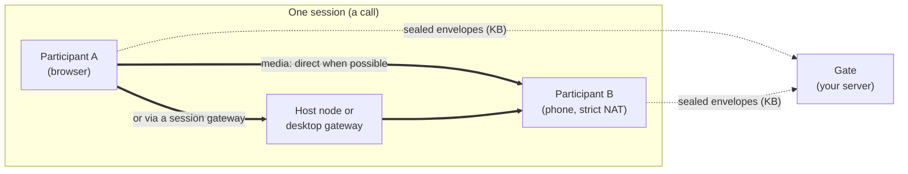

<div align="center">


# freehop

### Voice and video, inside your app.

Open-source calling for small meeting rooms, in-app conversations, shared workspaces and Electron apps.

**[Try the demos](https://jolynstudios.github.io/freehop/demos)** · **[Documentation](https://jolynstudios.github.io/freehop/docs)** · **[Quickstart](#quickstart)** · **[Protocol](PROTOCOL.md)**


</div>

**New in 0.1.0-alpha.6:** your own TURN relay (`turn`, opt-in since alpha.5) now stays the last
resort after it connects a call. A pair it carries keeps checking for a cheaper route, moves to a
direct route or a gateway as soon as one works, and then releases the relay. Like port prediction
(`portPrediction`) and NAT classification (`classifyNat`), it is off unless you configure it, so
existing integrations behave exactly as before. Install the current alpha from
[npm](https://www.npmjs.com/package/freehop), or download the
[GitHub release](https://github.com/jolynstudios/freehop/releases/tag/v0.1.0-alpha.6).

```sh
npm install freehop@alpha
```

See the [TypeScript guide](https://jolynstudios.github.io/freehop/docs/typescript) for typed sessions,
events and backend APIs. JavaScript usage is unchanged.

## Add a call to what you’re building

Build a small meeting app, add a support call to an existing tool, or put voice beside a shared workspace. Freehop provides audio, optional video and small session messages inside your own interface. The same SDK also fits community rooms and games.

**Build with AI. Build without it. Own the result.** Use an AI coding agent to scaffold an integration or write it yourself. Freehop has an inspectable JavaScript API and source; bring your own models, application logic, authentication and backend. It does not include an AI model, transcription service, or agent runtime.

| Start here | What you can try |
|---|---|
| [Hopper](https://jolynstudios.github.io/freehop/hopper) | Small rooms with device preview, video, voice and chat. |
| [Live demo](https://jolynstudios.github.io/freehop/demo) | A real browser call with connection-path and playback inspection. |

Open Hopper or the live demo in two browsers, or share a room link with someone. Both run the real Freehop client and demonstrate voice, video and session connections.

### Where it fits

| Build | Freehop provides | Your app provides |
|---|---|---|
| Small meeting rooms | Voice, video, controls and chat messages | Room UI, invitations and admission |
| Calls inside a portal or tool | A call attached to the current task | Identity, access rules and customer/project data |
| Shared workspaces | Media plus small selection or ready events | Editor, document sync and persistence |
| Electron collaboration apps | Renderer client and optional desktop gateway | Desktop UI, packaging and updates |
| Community rooms and games | Voice-first rooms, optional video, small events | Community rules, activity or game logic |

These are integration ideas; Hopper and the live demo are the working examples. See the [use-case recipes](https://jolynstudios.github.io/freehop/docs/use-cases).

Read the [Three.js integration guide](https://jolynstudios.github.io/freehop/docs/games), [Electron reference](https://jolynstudios.github.io/freehop/docs/sdk/desktop), or [AI build brief](https://jolynstudios.github.io/freehop/docs/build-with-ai).

---

WebRTC first tries to connect people directly. Strict NATs and firewalls can block that path, so
some applications use TURN servers to relay media. If you rent a TURN service, its traffic may
appear on your infrastructure bill.

**Freehop is an open-source SDK, not a hosted calling service.** It has no Freehop subscription
or per-minute fee. Its *gates* introduce participants and exchange sealed setup messages; gates
do not carry media. When a direct connection fails, media can use a participant's gateway, the
session host, or another participant. If you run that gateway or host on infrastructure you pay
for, its bandwidth and compute can still appear on your bill. If no route inside the session
works, Freehop reports `unreachable` instead of sending media through an operator-run gate. Your app
can opt into its own TURN relay as a last resort before that; it then carries only the calls that
would otherwise fail, and its bandwidth is yours (a provider's free tier usually covers it).

## Why Freehop

| | |
|---|---|
| **No media through your gate** | Gates carry sealed signalling only. In every home-lab network test, gate traffic for an entire scenario stayed between 30 and 210 KB. A session gateway you run can still carry media on your bill. |
| **Routes through the session** | Two strict (symmetric) NATs, or a network that blocks UDP, can't connect directly. Freehop routes them through a session member's gateway or the session host, without sending media through the signalling gate. When nobody in the session can help, an app can opt into port prediction or its own TURN relay before `unreachable`. |
| **Multiple signalling gates** | Run one gate or many, operated by you, your community, or public WebTorrent trackers. Peers on different gates still find each other. **Calls keep running when every gate is down.** |
| **Private by construction** | Signalling is sealed (HKDF + AES-256-GCM), so gates can't read or forge envelopes. Direct and gateway paths preserve end-to-end DTLS-SRTP; a forwarding participant decodes and re-encodes media. |
| **Automatic** | No manual room link is required in a ticket-based integration. Your backend issues a ticket, and the SDK takes the cheapest path that works: direct, then gateway, then relay, then bridge, then (only if you opt in) port prediction and your own TURN relay. |
| **Small and open** | Zero-dependency browser client; a gate with one runtime dependency (`ws`); TURN gateway and PCP / NAT-PMP / UPnP port mapping in plain Node. Apache-2.0. |

## How it works



1. **Your backend issues tickets.** `createAuthority()` owns each room's secret. A member gets a ticket over your own authenticated channel.
2. **Gates introduce.** Clients announce on every gate in the ticket and exchange sealed envelopes. Once linked, signalling moves onto the peers' own data channels. A gate can be your own small server or a public WebTorrent tracker: the envelopes ride in the offer and answer messages that trackers already pass between browsers ([how](https://jolynstudios.github.io/freehop/docs/concepts/trackers)).
3. **The path ladder finds a route.** Freehop tries direct first (LAN, IPv6, STUN). If that fails it uses an endpoint's own gateway, then a gateway of another session member, then forwarding through a participant. Apps can opt into two more attempts after that: port prediction and their own TURN relay. A failure is reported honestly as `unreachable`.
4. **Kicks rotate keys.** `authority.kick()` issues a new room secret; remaining members `update()` and drop the kicked peer.

## Published network evidence

These results come from Freehop's own home-built, isolated Linux network test environment—not
an independent testing laboratory or tests on live ISP, mobile or corporate networks. Real
**Chromium 151, Firefox 153 and WebKit 26.5** ran behind Linux kernel NAT profiles, with fake
cameras and microphones. Every run asserts the path taken and that audio *and* video actually
arrive.

| Network situation | Result | Route Freehop chose |
|---|---|---|
| Two home routers | ✅ 3/3 | direct |
| IPv6 available, IPv4 UDP blocked | ✅ 3/3 (+ Firefox/WebKit) | direct over IPv6 |
| Two strict/symmetric NATs + a third participant | ✅ 3/3 (+ cross-browser) | forwarded by the participant |
| Strict NAT ↔ desktop participant behind a UPnP router | ✅ 3/3 (+ cross-browser) | the desktop's own gateway |
| Two strict NATs + a desktop participant | ✅ 3/3 (+ cross-browser) | relay through that participant's gateway |
| UDP-blocking firewall ↔ desktop participant | ✅ 3/3 (+ cross-browser) | gateway over TCP |
| Two UDP-blocked peers + a desktop participant | ✅ 3/3 | relay over TCP |
| Two strict NATs, session hosted on a server node | ✅ 3/3 (+ cross-browser) | the host node's gateway |
| Two UDP-blocked peers, server-hosted session | ✅ 3/3 | the host node's gateway |
| Two strict NATs and nobody else | ✅ 3/3 | `unreachable` (correctly reported) |
| A network that can only reach the gate | ✅ 3/3 | `unreachable` (no route exists without your server) |

**40/40 home-lab network test runs passed** on 2 October 2026 after security hardening,
including gateways that relay only inside their session. On 9 October 2026 every scenario above ran
once more with Chromium for 0.1.0-alpha.5, in the same lab packaged as a Docker container
(`lab/docker.sh`), and took the same route. New scenarios for the opt-in last resorts, also run once
with Chromium on 9 October:

| Network situation | Result | Route Freehop chose |
|---|---|---|
| Home router ↔ strict NAT, nobody else (default options) | ✅ 1/1 | `unreachable` (a limit, now documented) |
| UDP-blocking firewall ↔ home router, nobody else (default options) | ✅ 1/1 | `unreachable` (a limit, now documented) |
| Two strict NATs + the app's own TURN relay (`turn`) | ✅ 1/1 | relay via `turn` over UDP |
| Two UDP-blocked peers + the app's own TURN relay (`turn`) | ✅ 1/1 | relay via `turn` over TCP |
| Strict NAT ↔ home router, and two strict NATs, with `portPrediction` | ✅ 1/1 each | `unreachable`, no prediction attempted (random NATs are never predicted) |

Port prediction's success case (a NAT that hands out ports in order) cannot be simulated in this
lab and is not yet verified on real networks, so it stays off by default. These are repeatable
simulated-network results, not field reliability evidence. Other checks:
- **208/208 unit tests** on 10 October 2026, including the RFC 5769 STUN vectors, the security regressions, the opt-in route tests and leaving the TURN relay.
- **coturn's own test client** against Freehop's TURN server on 9 October 2026: 800/800 messages over UDP and 800/800 over TCP, 0 lost.
- **Browser suites** (`npm run ship`, 10 October 2026): a Chromium, Firefox and WebKit mesh over TLS, multi-gate with every gate shut down mid-call, kick/rekey, the SDK example app, two Chromium peers that can only connect through the app's TURN relay, and two Chromium peers that leave that relay for a direct route without an audio gap and release it. A public WebTorrent tracker as the only gate was verified in the original test run.
- **Release gates:** `laddergate` replays 23 connection scenarios, and the 12 without the opt-in routes must match traces recorded before those routes existed, and `contractgate` freezes the public API, wire format and ticket format.

Full details are in [RESULTS.md](RESULTS.md).

## Quickstart

```bash
npm install freehop@alpha                 # install the current alpha release
```

**Backend:** decide who is in a room.
```js
import { createAuthority } from 'freehop/authority';
const authority = createAuthority({
  app: 'my-app',
  gates: ['wss://example.com/freehop'],
  gateTokenSecrets: { 'wss://example.com/freehop': process.env.FREEHOP_GATE_TOKEN_SECRET },
  stun: ['stun:example.com:3478']
});
await authority.openRoom('room-42');
const ticket = await authority.ticket('room-42', userId);   // send over your own channel
```

**Client:** join the call.
```js
import { connect } from 'freehop';
const session = await connect(ticket, { media: { audio: true } });
session.on('track', ({ peer, track }) => session.attach(track, audioElementFor(peer)));
session.on('path', ({ peer, kind }) => console.log(peer, 'is', kind));  // direct | gateway | relay | bridged | unreachable
```

**Optional: a last resort before `unreachable`.** Off by default. Hand tickets your own TURN
servers, and let clients try predicted ports first:
```js
const authority = createAuthority({
  app: 'my-app', gates: ['wss://example.com/freehop'],
  stun: ['stun:example.com:3478', 'stun:stun2.example.net:3478'],  // port prediction needs two or more
  turn: async ({ expires }) => mintTurnCredentials(expires)  // your provider: [{ urls, username, credential }]
});
const session = await connect(ticket, { media: { audio: true }, portPrediction: true });
session.on('path', ({ kind, via }) => { if (via === 'turn') console.log('carried by your TURN relay'); });
```
The relay carries only calls that would otherwise fail, and its bandwidth is yours. A provider's free
tier, or Freehop's own TURN server (`freehop/turn`) on a machine you already run, can keep that at zero.
See [SDK.md](SDK.md#when-no-route-exists-opt-in).

**Gate:** the signalling service. Set `FREEHOP_GATE_TOKEN_SECRET` to the same private signing key (at least 32 characters) in the backend and gate environments, and put the gate behind your TLS proxy.
```bash
FREEHOP_GATE_PORT=8787 FREEHOP_GATE_PUBLIC_HOST=example.com \
FREEHOP_GATE_STUN='0.0.0.0:3478,[::]:3478' \
FREEHOP_GATE_TOKEN_SECRET="$FREEHOP_GATE_TOKEN_SECRET" \
FREEHOP_GATE_TOKEN_AUDIENCE=wss://example.com/freehop \
FREEHOP_GATE_TRUST_PROXY=1 ./node_modules/.bin/freehop-gate
```
Run the installed copy, not an unpinned `npx freehop-gate`: the local binary uses the `freehop` dependency in your project, while `npx` can resolve a different package from the registry. From a checkout, run `node bin/freehop-gate.mjs`.

Desktop apps (Electron) and session hosts get one call each. See [SDK.md](SDK.md). For a
complete runnable consumer, run `npm run example` and open it in two windows. Existing integrations should follow the [security model](PROTOCOL.md): gateway credentials now come from a privileged broker, tokens name their gate, and STUN servers come from application configuration. Use `authority.kick()` for membership revocation; `disconnectPeer()` is local removal only.

## How Freehop compares

Every option below can put people in a call. What differs is where the audio and video go when
two people cannot connect directly, and who pays for that traffic.

| Option | What it is | When a direct route fails, media goes through | Your media bill | Built for | License |
|---|---|---|---|---|---|
| **Freehop** | Peer-to-peer SDK plus small signalling gates | Machines in the session: a participant's desktop gateway, the host node, or a forwarding participant; optionally your own TURN relay as a last resort | **Gates carry no media; operator cost depends on who runs the session gateway, and an opt-in TURN relay bills only the calls that need it** | 2 to 8 people (mesh) | Apache-2.0 |
| WebRTC + your own TURN | The browser API, plus the servers you build (e.g. coturn) | Your TURN server | Every relayed byte | Small groups (mesh), more with an SFU you add | coturn: BSD-3-Clause |
| [PeerJS](https://peerjs.com) | Library for one-to-one connections by peer id, with PeerServer signalling | A TURN server you supply; its free TURN service closed in December 2023 | Yours, once you add TURN | One-to-one; groups are a mesh you build | MIT |
| [Trystero](https://github.com/dmotz/trystero) | Serverless peer-to-peer matchmaking library | A TURN server you add; without one, hard-NAT pairs fail | Yours, once you add TURN | Small groups (mesh) | MIT |
| [LiveKit](https://livekit.io) | Open-source SFU server and SDKs, or LiveKit Cloud | Every stream goes through the SFU, with built-in TURN | Your servers' bandwidth, or Cloud pricing per minute and GB | Large rooms, livestreams, AI agents | Apache-2.0 |
| [Jitsi Meet](https://jitsi.org) | Complete meeting app: Videobridge SFU with XMPP signalling | With 2 people it tries a direct link; with 3 or more, every stream goes through the Videobridge | Your servers' bandwidth, or 8x8's hosted JaaS | Meetings with dozens of people | Apache-2.0 |
| [mediasoup](https://mediasoup.org) | SFU library for Node.js or Rust, with a C++ media worker | Always your SFU server | Your servers' bandwidth | Large rooms you build yourself | ISC |
| Hosted video APIs | Daily, Agora, Twilio Video, Cloudflare Realtime and others | The provider's servers: most send every stream through them | Per participant-minute, or per GB (Cloudflare) | Large rooms, nothing to run | Proprietary |

Freehop is built for products where **people in the session can help carry their own call**:
small meetings, in-app calls, shared workspaces, communities and games. If you run the session host or gateway on your
own paid infrastructure, its media traffic is still your cost. If you need 50-person rooms,
recording, or centrally hosted media, consider an SFU or a paid relay. Connectivity still depends
on transport support and firewall rules. The [full comparison](https://jolynstudios.github.io/freehop/docs/comparison)
adds signalling and encryption, with sources.

## Honest limits

- **Room size needs admission control.** The initial target is rooms of 2 to 8 people; eight was chosen for that target, not established by a capacity benchmark. The SDK's
  `limits.maxPeers` defaults to 8 remote peers per client; it is not a room-size cap.
  Your backend must limit membership before issuing tickets. Excess peers are silently
  ignored, which can leave a larger room only partly connected.
- **Unrouteable networks.** A network that lets a user reach *only* your gate has no route
  for media without your server carrying it. Freehop reports `unreachable` instead of
  silently paying for a relay.
- **Hard NATs need someone with a reachable route.** Two browser-only users, both behind
  strict NATs or UDP-blocking networks, with no IPv6 and nobody else in the session, cannot
  connect by default. Two opt-in rungs run just before `unreachable`: port prediction for NATs
  that allocate ports in order, and your own TURN relay (`turn`), whose bandwidth is then yours.
  See [SDK.md](SDK.md#when-no-route-exists-opt-in).
- **Home-lab tested, not field-proven.** Real ISPs, 4G/5G carrier NAT, corporate networks
  and mobile browsers remain unverified. Status: **alpha**.
- **Firefox through your own TURN relay is work in progress.** In the relay-only browser test,
  Firefox gets no audio in one direction through the application relay, also on alpha.5, while
  Chromium connects. Firefox through desktop gateways and host nodes passed the home-lab tests.
- **Forwarded media is re-encoded.** When a participant forwards the call, it re-encodes the
  media. That participant is in the call anyway.

## Repository map

| Path | What |
|---|---|
| `src/client/` | Browser client: rooms, sealed signalling, path ladder, bridging, media |
| `src/sdk/` | SDK: `authority` (backend), `connect` (client), `host`, tickets |
| `src/gate/` + `bin/freehop-gate.mjs` | Gate service with optional STUN |
| `src/relay/` | TURN gateway, PCP / NAT-PMP / UPnP port mapper, host-node member |
| `src/electron/` | Desktop helper (main + preload) |
| `examples/minimal/` | A complete reference app |
| `lab/` | Reproducible Linux NAT test harness; `lab/docker.sh` runs it in a disposable Docker container |
| `tools/` | Release gates (`npm run ship`), including the ladder and contract gates |
| `website/` | The documentation site (Docusaurus) |

## Releases

[0.1.0-alpha.6](https://github.com/jolynstudios/freehop/releases/tag/v0.1.0-alpha.6) keeps the application's TURN relay the last resort after it connects: a pair it carries moves to a cheaper route when one works and releases the relay. [0.1.0-alpha.5](https://github.com/jolynstudios/freehop/releases/tag/v0.1.0-alpha.5) added opt-in last resorts before `unreachable` (your own TURN relay, port prediction, NAT classification), all off by default, plus release gates that check existing connection behaviour stays unchanged. [0.1.0-alpha.4](https://github.com/jolynstudios/freehop/releases/tag/v0.1.0-alpha.4) added TypeScript declarations for all 15 public entry points. See the [release changelog](https://github.com/jolynstudios/freehop/releases) for changes and validation, and install `freehop@alpha` from npm.

## Get involved

- **Star the repo** to follow progress toward real-network testing and a 1.0 release.
- **Try the [live demo](https://jolynstudios.github.io/freehop/demo)**: a real call between two
  browser tabs, introduced through public trackers with no server of ours.
- **Building with Freehop?** [Open an issue](https://github.com/jolynstudios/freehop/issues)
  and tell us about your use case. Integration reports directly shape the SDK.

## License and warranty

- Code: **Apache License 2.0** ([LICENSE](LICENSE)).
- Documentation and protocol specification: **CC BY 4.0** ([LICENSE-docs](LICENSE-docs)).
- Attributions: [NOTICE](NOTICE).

> **No warranty.** Freehop is provided "as is", without warranties or conditions of any kind.
> You use it entirely at your own risk.

Copyright 2026 Jolyn Studios.
