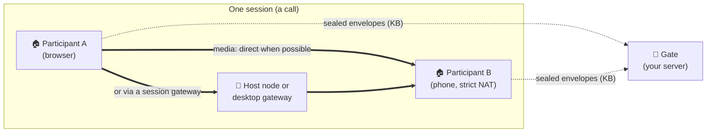

<div align="center">

# Freehop

### Voice and video between your users, without your servers carrying the call.

**[Live demo](https://jolynstudios.github.io/freehop/demo)** ·
**[Documentation](https://jolynstudios.github.io/freehop/)** ·
**[Quickstart](#quickstart)** ·
**[Architecture](ARCHITECTURE.md)** ·
**[Protocol](PROTOCOL.md)**


</div>

---

Adding voice or video to a game or app comes with a hidden bill. WebRTC connects people
directly when it can. When it can't, because of strict NATs or firewalls that block UDP, the
standard answer is a **TURN relay that you run and pay for**. Every byte of those calls flows
through your servers. Historical measurements from 2015–2017 found relay use in roughly one fifth of calls or conferences on those services; they are not a current prediction
([callstats.io: ~22%](https://webrtchacks.com/usage-stats/),
[appear.in: ~17.7%](https://medium.com/@fippo/what-kind-of-turn-server-is-being-used-d67dbfc2ff5d)),
and managed TURN is billed per gigabyte (e.g.
[$0.05/GB](https://developers.cloudflare.com/realtime/turn/)).

**Freehop removes your servers from the media path entirely.** Your infrastructure only runs
small *gates* that introduce people to each other: tens of kilobytes of sealed signalling per
call, plus presence announcements and connection recovery. When a direct connection is impossible, the call hops through machines that
**already belong to the session**: a desktop participant's own router-mapped gateway, the machine
hosting the session, or another participant. The cost of a call stays with the people on it.

## Why Freehop

| | |
|---|---|
| 💸 **Zero media on your servers** | Gates carry sealed signalling only. In every lab run, gate traffic for an entire scenario stayed between 30 and 210 KB, with no media at all. |
| 🧱 **Connects the "impossible" pairs** | Two strict (symmetric) NATs, or a network that blocks UDP, can't connect directly. Freehop routes them through a session member's gateway or the session host, still with no operator relay. |
| 🛰️ **No single point of failure** | Run one gate or many, operated by you, your community, or public WebTorrent trackers. Peers on different gates still find each other. **Calls keep running when every gate is down.** |
| 🔐 **Private by construction** | Signalling is sealed (HKDF + AES-256-GCM), so gates can't read or forge envelopes. Direct and gateway paths preserve end-to-end DTLS-SRTP; a forwarding participant decodes and re-encodes media. |
| ⚙️ **Automatic** | No manual room link is required in a ticket-based integration. Your backend issues a ticket, and the SDK takes the cheapest path that works: direct, then gateway, then relay, then bridge. |
| 📦 **Small and open** | Zero-dependency browser client; a gate with one dependency (`ws`); TURN gateway and PCP / NAT-PMP / UPnP port mapping in plain Node. Apache-2.0. |

## How it works



1. **Your backend issues tickets.** `createAuthority()` owns each room's secret. A member gets a ticket over your own authenticated channel.
2. **Gates introduce.** Clients announce on every gate in the ticket and exchange sealed envelopes. Once linked, signalling moves onto the peers' own data channels. A gate can be your own small server or a public WebTorrent tracker: the envelopes ride in the offer and answer messages that trackers already pass between browsers ([how](https://jolynstudios.github.io/freehop/docs/concepts/trackers)).
3. **The path ladder finds a route.** Freehop tries direct first (LAN, IPv6, STUN). If that fails it uses an endpoint's own gateway, then a gateway of another session member, then forwarding through a participant. A failure is reported honestly as `unreachable`.
4. **Kicks rotate keys.** `authority.kick()` issues a new room secret; remaining members `update()` and drop the kicked peer.

## Proof, not promises

The original qualification ran in an isolated Linux lab with real **Chromium 151, Firefox 153 and WebKit 26.5**.
Each browser sits behind its own kernel NAT router profile, with fake camera and microphone.
Every run asserts the path taken and that audio *and* video actually arrive.

| Network situation | Result | Route Freehop chose |
|---|---|---|
| Two home routers | ✅ 3/3 | direct |
| IPv6 available, IPv4 UDP blocked | ✅ 3/3 (+ Firefox/WebKit) | direct over IPv6 |
| Two strict/symmetric NATs + a third participant | ✅ 3/3 (+ cross-browser) | forwarded by the participant |
| Strict NAT ↔ desktop participant behind a UPnP router | ✅ 3/3 (+ cross-browser) | the desktop's own gateway |
| Two strict NATs + a desktop participant | ✅ 3/3 (+ cross-browser) | relay through that participant's gateway |
| UDP-blocking firewall ↔ desktop participant | ✅ 3/3 (+ cross-browser) | gateway over TCP |
| Two UDP-blocked peers + a desktop participant | ✅ 3/3 | relay over TCP |
| Two strict NATs, session hosted on a server node | ✅ 3/3 (+ cross-browser) | the host node's gateway |
| Two UDP-blocked peers, server-hosted session | ✅ 3/3 | the host node's gateway |
| Two strict NATs and nobody else | ✅ 3/3 | `unreachable` (correctly reported) |
| A network that can only reach the gate | ✅ 3/3 | `unreachable` (no route exists without your server) |

**40/40 lab runs passed** on the current revision, re-run on 2 October 2026 after security hardening, including gateways that relay only inside their session. Other checks:
- **151/151 unit tests**, including the RFC 5769 STUN vectors and the security regressions.
- **coturn's own test client** against Freehop's TURN server: 800/800 messages over UDP and 800/800 over TCP, 0 lost.
- **Browser suites:** multi-gate with every gate shut down mid-call, kick/rekey, a public WebTorrent tracker as the only gate, and the SDK example app.

Full details are in [RESULTS.md](RESULTS.md).

## Example consumer: Redline Wars

[**Redline Wars**](https://redlinewars.online) is a real-time strategy game that runs in the
browser and as a desktop app ([source](https://github.com/jolynstudios/redlinewars)). It is
one planned consumer of Freehop. The game is integrating the independent SDK
**through the public SDK only**, exactly like any other app would:

- the match host acts as the session's gateway;
- desktop participants open their own front door through their router;
- browser participants simply join.

Freehop is an independent project; any app can use the same public SDK.

## Quickstart

```bash
npm install freehop@alpha                 # current alpha: 0.1.0-alpha.0
```

**Backend:** decide who is in a room.
```js
import { createAuthority } from 'freehop/authority';
const authority = createAuthority({
  app: 'my-app',
  gates: ['wss://example.com/freehop'],
  gateTokenSecrets: { 'wss://example.com/freehop': process.env.FREEHOP_GATE_TOKEN_SECRET },
  stun: ['stun:example.com:3478']
});
await authority.openRoom('room-42');
const ticket = await authority.ticket('room-42', userId);   // send over your own channel
```

**Client:** join the call.
```js
import { connect } from 'freehop';
const session = await connect(ticket, { media: { audio: true } });
session.on('track', ({ peer, track }) => session.attach(track, audioElementFor(peer)));
session.on('path', ({ peer, kind }) => console.log(peer, 'is', kind));  // direct | gateway | relay | bridged | unreachable
```

**Gate:** the signalling service. Set `FREEHOP_GATE_TOKEN_SECRET` to the same private signing key (at least 32 characters) in the backend and gate environments, and put the gate behind your TLS proxy.
```bash
FREEHOP_GATE_PORT=8787 FREEHOP_GATE_PUBLIC_HOST=example.com \
FREEHOP_GATE_STUN='0.0.0.0:3478,[::]:3478' \
FREEHOP_GATE_TOKEN_SECRET="$FREEHOP_GATE_TOKEN_SECRET" \
FREEHOP_GATE_TOKEN_AUDIENCE=wss://example.com/freehop \
FREEHOP_GATE_TRUST_PROXY=1 ./node_modules/.bin/freehop-gate
```
Run the installed copy, not an unpinned `npx freehop-gate`: the local binary uses the `freehop` dependency in your project, while `npx` can resolve a different package from the registry. From a checkout, run `node bin/freehop-gate.mjs`.

Desktop apps (Electron) and session hosts get one call each. See [SDK.md](SDK.md). For a
complete runnable consumer, run `npm run example` and open it in two windows. Existing integrations should follow the [security model](PROTOCOL.md): gateway credentials now come from a privileged broker, tokens name their gate, and STUN servers come from application configuration. Use `authority.kick()` for membership revocation; `disconnectPeer()` is local removal only.

## How Freehop compares

Every option below can put people in a call. What differs is where the audio and video go when
two people cannot connect directly, and who pays for that traffic.

| Option | What it is | When a direct route fails, media goes through | Your media bill | Built for | License |
|---|---|---|---|---|---|
| **Freehop** | Peer-to-peer SDK plus small signalling gates | Machines in the session: a participant's desktop gateway, the host node, or a forwarding participant | **No operator media bill; session machines carry the traffic** | 2 to 8 people (mesh) | Apache-2.0 |
| WebRTC + your own TURN | The browser API, plus the servers you build (e.g. coturn) | Your TURN server | Every relayed byte | Small groups (mesh), more with an SFU you add | coturn: BSD-3-Clause |
| [PeerJS](https://peerjs.com) | Library for one-to-one connections by peer id, with PeerServer signalling | A TURN server you supply; its free TURN service closed in December 2023 | Yours, once you add TURN | One-to-one; groups are a mesh you build | MIT |
| [Trystero](https://github.com/dmotz/trystero) | Serverless peer-to-peer matchmaking library | A TURN server you add; without one, hard-NAT pairs fail | Yours, once you add TURN | Small groups (mesh) | MIT |
| [LiveKit](https://livekit.io) | Open-source SFU server and SDKs, or LiveKit Cloud | Every stream goes through the SFU, with built-in TURN | Your servers' bandwidth, or Cloud pricing per minute and GB | Large rooms, livestreams, AI agents | Apache-2.0 |
| [Jitsi Meet](https://jitsi.org) | Complete meeting app: Videobridge SFU with XMPP signalling | With 2 people it tries a direct link; with 3 or more, every stream goes through the Videobridge | Your servers' bandwidth, or 8x8's hosted JaaS | Meetings with dozens of people | Apache-2.0 |
| [mediasoup](https://mediasoup.org) | SFU library for Node.js or Rust, with a C++ media worker | Always your SFU server | Your servers' bandwidth | Large rooms you build yourself | ISC |
| Hosted video APIs | Daily, Agora, Twilio Video, Cloudflare Realtime and others | The provider's servers: most send every stream through them | Per participant-minute, or per GB (Cloudflare) | Large rooms, nothing to run | Proprietary |

Freehop is built for products where **people in the session can help carry their own call**:
games, small-group voice and video, communities. If you need 50-person rooms, recording, or a
guarantee on networks that block everything except your server, an SFU or a paid relay is the
right tool. The [full comparison](https://jolynstudios.github.io/freehop/docs/comparison) adds
signalling and encryption, with sources.

## Honest limits

- **Room size needs admission control.** The initial target is rooms of 2 to 8 people; eight was chosen for that target, not established by a capacity benchmark. The SDK's
  `limits.maxPeers` defaults to 8 remote peers per client; it is not a room-size cap.
  Your backend must limit membership before issuing tickets. Excess peers are silently
  ignored, which can leave a larger room only partly connected.
- **Unrouteable networks.** A network that lets a user reach *only* your gate has no route
  for media without your server carrying it. Freehop reports `unreachable` instead of
  silently paying for a relay.
- **Hard NATs need someone with a reachable route.** Two browser-only users, both behind
  strict NATs or UDP-blocking networks, with no IPv6 and nobody else in the session, cannot
  connect.
- **Lab-qualified, not field-proven yet.** Real ISPs, 4G/5G carrier NAT, corporate networks
  and mobile browsers are being tested next. Status: **alpha**.
- **Forwarded media is re-encoded.** When a participant forwards the call, it re-encodes the
  media. That participant is in the call anyway.

## Repository map

| Path | What |
|---|---|
| `src/client/` | Browser client: rooms, sealed signalling, path ladder, bridging, media |
| `src/sdk/` | SDK: `authority` (backend), `connect` (client), `host`, tickets |
| `src/gate/` + `bin/freehop-gate.mjs` | Gate service with optional STUN |
| `src/relay/` | TURN gateway, PCP / NAT-PMP / UPnP port mapper, host-node member |
| `src/electron/` | Desktop helper (main + preload) |
| `examples/minimal/` | A complete reference app |
| `lab/` | Disposable Linux NAT lab that reproduces every result |
| `website/` | The documentation site (Docusaurus) |

## Get involved

- ⭐ **Star the repo** to follow progress toward the field-tested 1.0.
- 🎮 **Try the [live demo](https://jolynstudios.github.io/freehop/demo)**: a real call between two
  browser tabs, introduced through public trackers with no server of ours.
- 🛠️ **Building a game or app on Freehop?** [Open an issue](https://github.com/jolynstudios/freehop/issues)
  and tell us about your use case. Integration reports directly shape the SDK.

## License and warranty

- Code: **Apache License 2.0** ([LICENSE](LICENSE)).
- Documentation and protocol specification: **CC BY 4.0** ([LICENSE-docs](LICENSE-docs)).
- Attributions: [NOTICE](NOTICE).

> **No warranty.** Freehop is provided "as is", without warranties or conditions of any kind.
> You use it entirely at your own risk.

Copyright 2026 Jolyn Studios. Freehop was developed under the codename *Peerlane*; some protocol
identifiers keep that name.
